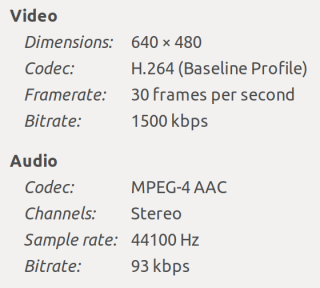
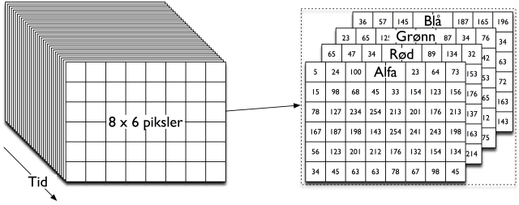

> ## Introduce yourself
>
> Please spend one minute to introduce yourself in the [digital pad](http://pad.software-carpentry.org/2018-02-09-Oslo-MGT) we will use during the workshop. 
{: .challenge}

## Why video analysis?

For researchers interested in studying humans and human motion, a regular video recording is often the easiest, fastest and cheapest solution to start with. Nowadays, everyone has access to fairly high quality video cameras even in their mobile phones, and the cost of professional-quality video cameras is also within the reach for many researchers.

One of the positive things about video analysis is that it opens for a broad range of analysis techniques, from purely qualitative methods to purely quantitative. For example, having a video recording that can be played back multiple times, and at various speeds, is very useful for visual inspection. And, as we shall see later, even a regular video recording can be used to extract meaningful quantitative motion data. Furthermore, it is also common to use video recordings as a reference when recording motion with sensor-based motion tracking technologies. In such cases, the video recording can be used to help the qualitative interpretation of numerical results.

> ## What is a video file?
> 
> Let us start by understanding more about what a video file contains. Find a video file on your computer, for example the file *dance.avi* from the example folder. On most systems (Linux, Mac, Windows) you should be able to see some basic information about the video content by selecting something like "properties" from the file inspector.
> 
> - What are the dimensions?
> - What is the framerate? 
> - What type of compression is used? 
> 
> The important thing to understand here, is that a digital video file can be seen as a series of still images. This opens for doing various types of mathematical operations on the file. 
{: .challenge}

This is a typical file dialog with information about a file: 

 

Here we can see the dimensions (640 pixels wide, 480 pixels heigh) and framerate (30 frames per second). 

## Compression

The file looked at in the file dialog above has been compressed with H.264. This is the most common video compression codec these days. It is a lossy codec, meaning that it throws away lots of data when it compresses. H.264 is also a time-based compression codec, meaning that it compares frames over time, and only stores the information that change between so-called keyframes. This is an efficient way of creating good-looking videos, but it is less ideal for analytical purposes. 

For analysis we often prefer to use MJPEG (Motion JPEG), which is a format that stores a complete image for each frame. This leads to larger video files, but faster and easier processing. 

When dealing with video files in Matlab, we have found that the good old .AVI container format is the most reliable. Matlab can handle other formats too, but .AVI files are the only ones that work on all platforms (Linux, Mac, Windows). 

## Video as a stream of numbers

As this figure illustrates, a video file is just a series of matrices with numbers: 

In a normal video file, each pixel is stored with a number between 0 and 255, where 0 means black and 255 means white. Colour files have four planes, while greyscale images only need one plane. 

## Recording video for analysis

One thing to bear in mind is that a video recording meant for analytical purposes is quite different from a video recording shot for documentary or artistic purposes. The latter type of video is usually based on the idea of creating an aesthetically pleasing result, which often includes continuous variation in the shots through changes in the lighting, background, zooming, panning, etc. A video recording for analysis, on the other hand, is quite the opposite: it is best to record it in a controlled studio or lab setting with as few camera changes as possible. This is to ensure that it is the *content* of the recording, that is, the human motion, which is in focus, not the motion of the camera or the environment.

Even though a controlled environment may be the best choice from a purely scientific point of view, it is possible to obtain useful recordings for analytical purposes also out in the field. This, however, requires some planning and attention to detail. Here are a few things to consider:

-   Foreground/background: place the subject in front of a background
    that is as plain as possible, so it is possible to easily discern
    between the important and non-important elements in the image. For
    computer vision recordings it is particularly important to avoid
    backgrounds with moving objects, since these may influence the
    analysis.

-   Lighting: avoid changing lights, as they will influence the final
    video. In dark locations, or if the lights are changing rapidly
    (such as in a disco or club concert), it may be worth recording with
    an infrared camera. Some consumer cameras come with a “night mode”
    that serves the same purpose. Even though the visual result of such
    recordings may be unsatisfactory, they can still work well for
    computer-based motion analysis.

-   Camera placement: place the camera on a tripod, and avoid moving the
    camera while recording. Both panning and zooming makes it more
    difficult to analyse the content of the recordings later. If both
    overview images and close-ups are needed, it is better to use two
    (or more) cameras to capture different parts of the scene in
    question.

-   Image quality: it is always best to record at the highest possible
    spatial (number of pixels), temporal (frames per second) and
    compression (format and ratio) settings the camera allows for.
    However, the most important is to find a balance between image
    quality, file size and processing time.

As mentioned earlier, a video recording can be used as the starting
point for both qualitative and quantitative analysis. We will here look
at a couple of different possibilities, moving from more qualitative
visualisation methods to advanced motion capture techniques.

## Preparing video for analysis in Matlab

You can use a number of different types of video for analysis, but if we should highlight a few things, these would be: 

- Video: use MJPEG (Motion JPEG) as the compression format. This compresses each frame individually. 
- Audio: use uncompressed audio (16-bit PCM). If you need to use compression, MP3 compression (MPEG-1, Layer 3) is still more versatile than AAC (which is used in .MP4 files). If you use a bitrate of 192 Kbs or higher, you should not get too much artifacts. 

[FFMPEG](https://www.ffmpeg.org/) is a very useful (free) tool for doing all sorts of audio/video manipulation, and can be installed on most systems. It it somewhat intimidating for beginners, but the trick is just to know what works. Here is a oneliner that will convert from an .MP4 file into a .AVI file with MJPEG and PCM audio: 

    ffmpeg -i input.mp4 -c:a pcm_s16le -c:v mjpeg -q:v 3 -huffman optimal output.avi


