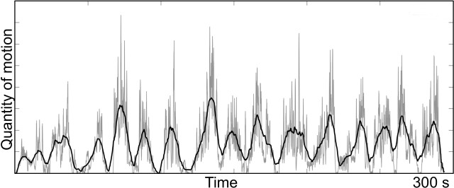
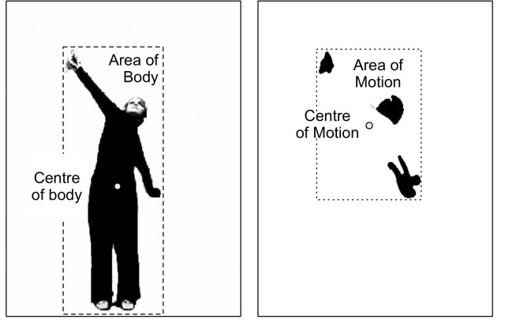

## Video visualisation

Videos can be watched as they are, but they can also be used to develop new visualisations to be used for analysis. The aim of creating such alternate displays from video recordings is to uncover features, structures and similarities within the material itself, and in relation to, for example, score material. Three useful visualisation techniques here are *motion images*, *motion history images* and *motiongrams*.

MGT can generate both dynamic and static visualizations, as well as some quantitative data: 

- dynamic visualisations (video files)
	- motion video
	- motion history video
- static visualisations (images)
	- motion average image
	- motiongrams
	- videograms
- motion data (csv files)
	- quantity of motion
	- centroid of motion
	- area of motion

In the following we will try this ourselves, and look at the different types. 

## Motion images

All of the analysis covered in this part is based on a very common technique in video analysis called "frame differencing". Here we create a *motion image* by calculating the absolute pixel difference between subsequent frames in the video file: 

The end result is an image where only the pixels that have changed between the frames are displayed. This can be interesting in itself, but motion images are also the starting point for many other video visualisation and analysis techniques.

> ## Simple motion analysis
> The easiest way to get started with analysing video with MGT is by just running the function mgmotion. You can try this with one of the example files like this: 
>
>     mgmotion('dance.avi');
>
> This will generate four files in the same location as your source file: 
> 
> - dance_motion.avi: the motion video that is used as the source for the rest of the analysis
> - dance_mgx.tiff: a horizontal motiongram
> - dance_mgy.tiff: a vertical motiongram
> - dance_data.csv: a data file with some quantitative features
> - dance_com_qom.eps: an image file with plots of centroid and quantity of motion
> 
> We will examine each of these in a little more detail. 
{: .challenge}

## Motion video

A motion video is a series of motion images, each showing only the motion happening between the two last frames in the original video file.

Matlab does not have an easy and universal approach of adding audio streams to exported video files. So if you want audio on your motion video, it is better to do that outside of Matlab, using [ffmpeg](http://www.ffmpeg.org). This oneliner will do the trick:

    ffmpeg -i dance.avi -i dance_motion.avi -c copy -map 1:v:0 -map 0:a:0 -shortest -c:v mpeg4 -c:a aac dance_motion_audio.mp4

Here we output to a compressed .MP4 file, which is a great format for video that is primarily meant for watching (not further analysis).

## Filtering

If you think there is too much noise in the output images or video, you may choose to use some other filter settings. Try this: 

    mgmotion('dance.avi','Diff','Regular',0.2);

Here a filter setting of 0.2 is used instead of 0.1. The number goes between 0 and 1, where 0 will let through all pixels, while 1 will only let through completely white pixels. The default setting is 0.1, and this usually works quite well for most videos. If you want more detail you can try setting it down to 0.05, or if you have too much noise you can raise it to 0.2 or 0.3. 

> ## Getting help
> You can always ask Matlab for help with any command, for example like this: 
>
>     help mgmotion
>
> which will tell you about the different options and settings. 
{: .callout}

## Motiongrams

While a motion history image may reveal information about the spatial
aspects of a motion sequence over a fairly short period of time, it is
possible to use a *motiongram* to display longer sequences. This display is
created by plotting the normalised mean values of the rows of a series
of motion images. The motiongram makes it possible to see both the
location and quantity of motion of a video sequence over time, and is
thus an efficient way of visualising longer motion sequences.

A motiongram is only a reduced display of a series of motion images,
with no analysis being done. It might help to think of the motiongram as
a display of a collapsed series of pictures, or “stripes,” where each
“stripe” summarises the content of a whole motion image.

Dependent on the frame rate of the video file, motiongrams can be
created from recordings as short as a few seconds to several hours. For
short recordings it is possible to follow detailed parts of a body,
particularly if there are relevant colours in the image, while
motiongrams of longer recordings will mainly reveal larger sections of
motion. Motiongrams work well together with audio spectrograms, and
other types of temporal displays such as graphs of motion or sound
features.

## Quantity of Motion

If you look at the content of dance.csv, it contains numbers like this:

    1.2162e+05,259.1,223.2
    97576,256.26,210.92
    88415,250.04,214.91
    76769,249.61,221.22
    81350,242.81,218.21
    77598,239.7,208.27
    70974,256.93,219.15

Here the first column contains the *quantity of motion* (QoM), which is the sum of active pixels in the image. The two next columns include the x and y values for the *centroid of motion*. The exported plot dance_motion_com_qom.eps gives you an idea of how the data looks like. The data are also available for further calculation and plotting (as we will get back to later).

The broad field of *computer vision* is concerned with extracting useful information from video recordings.  Some basic motion features that are commonly used in music research are derived directly from the motion image. Since the motion image only shows pixels that have changed between the two last frames in a video sequence, the sum of the values of all these individual pixels will give an estimate of the *quantity of motion* (QoM). Calculating the QoM for each frame will give a numeric series that can be plotted and used as an indicator of the activity

The *centroid of motion* (CoM) and *area of motion* (AoM) are other basic features that can easily be extracted from a motion image, and the differences between them are illustrated in Figure \[fig:37-com\]. The CoM and AoM features can be used to illustrate *where* in an image the motion occurs as well the spatial displacement of motion over time.



