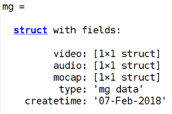

This example is showing how it is possible to use MGT for the combined analysis of visualization of video data together with video and audio. As opposed to the previous example, this requires the use of the MGT data structure for handling synchronization of the data streams. 

## Reading in multiple data files

We start by reading in three files from the same recording session: video (.mp4), audio (.wav) and motion capture data (.tsv):

    mg = mgread('pianist.mp4','pianist.wav','pianist.tsv');

This leads to the structure *mg* containting the following information: 

These are three very different types of files, and they therefore have to be treated differently inside of Matlab. The aim is that MGT should take care of most of these differences, so that you can work on the MGT structure directly. 

## Plotting together

Sometimes, it is necessary to show the motiongrams
and mocapgram. The function mgvideoplot plots the horizontal and vertical motiongram
combined with mocapgram over time.

    mgvideoplot(mgsegmo);

To look at motions more clearly, the vertical motiongram is transposed and the motion
grams are plotted by imagesc function after some noise removal. It can be showed that
31Figure 6: motiongram and mocapgram over time

Figure 7: horizontal and vertical motiongram,the vertical motiongram is transposed
the player repeats the similar action from the horizontal motiongram, which corresponds
to the quantity of motion. From the vertical motiongram, it is very clear to note there
32is only hand playing the piano from 19 seconds to 23 seconds. This explians why most
centroid of motion locate in the right side.

Next,let's continue to investigate the audio recording. mgwaveplot plots the waveform of
audio, root mean square,and their spectrum.

    mgwaveplot(mgsegmo);

Figure 8: waveform,rms and their spectrum

We may hope that the spectrum of the quantity of motion also gives us some useful
information. Here we can compare it with the spectrum of the rms.

Look at the spectrum of qom, the foundamental frequency is given by 5Hz, which is 0.2
seconds. This value is the same as period estimated by mgautocor function.

33Figure 9: spectrum of qom and rms
Figure 10: the first order feature space
34Figure 11: the second order feature space
